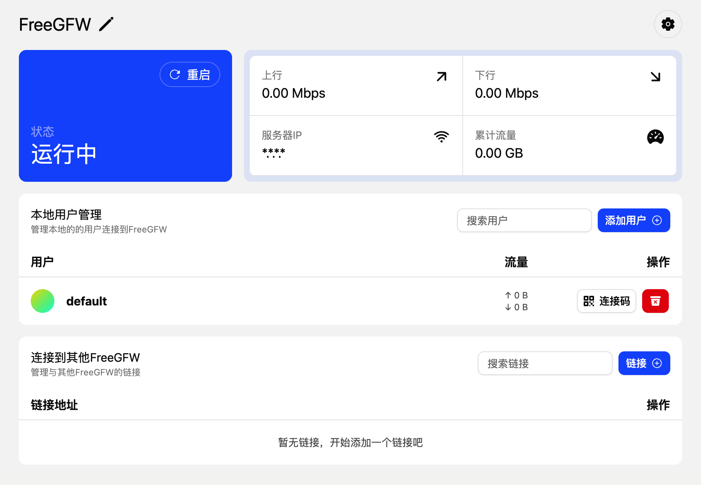
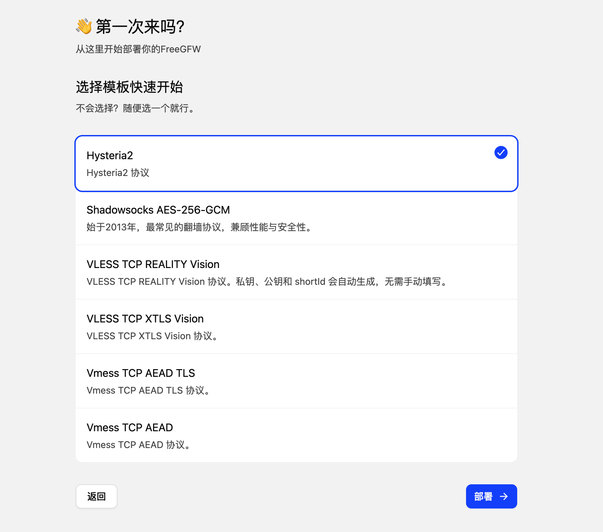
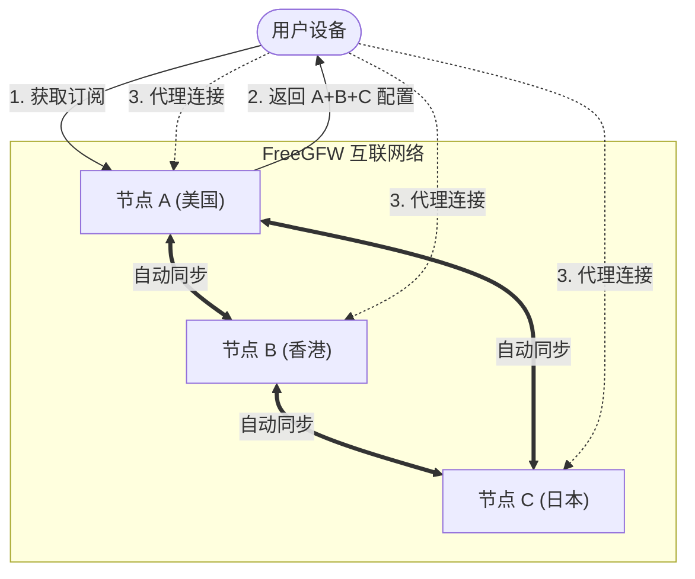

# FreeGFW

FreeGFW 是一个基于 [Sing-box](https://github.com/sagernet/sing-box) 核心构建的高性能代理服务管理系统。它提供了一个现代化的 Web 界面，用于轻松部署、管理和监控各类代理协议服务。

FreeGFW 的目标是提供一个简单易用、功能强大的代理服务管理系统，让用户可以轻松部署和管理自己的代理服务。让翻墙变得简单，让普通人也可以轻松使用代理服务。

## 📸 截图预览

  
  

## ✨ 主要特性

- 🚀 **高性能核心**: 基于 Sing-box 构建，支持最新的代理协议和特性。
- 🌐 **多协议支持**: 原生支持 VLESS (Reality/Vision), VMess, Shadowsocks, Hysteria2 等主流协议。
- 🖥️ **现代化仪表盘**: 内置 React + TailwindCSS 构建的 Web 管理界面，操作直观便捷。
- 👥 **用户管理**: 支持多用户系统，可为不同用户分配独立的配置。
- 📊 **流量监控**: 实时监控服务器的上传/下载速度，以及用户的流量使用情况。
- 🔒 **自动 HTTPS**: 集成 Let's Encrypt，自动申请和续期 SSL 证书。
- ⚡ **一键部署**: 支持 Docker 部署或直接运行二进制文件，开箱即用。

## 🚀 快速开始

### Docker 部署

docker run -d --name freegfw --network=host \
  -v "data:/data" \
  ghcr.io/haradakashiwa/freegfw

## 📝 配置说明

- **端口配置**: 默认端口 `8080`，可通过环境变量 `PORT` 修改。
- **数据存储**: 所有数据（数据库、证书、配置文件）默认存储在 `data/` 目录下。

## 🔗 链接功能 (Link Feature)

FreeGFW 独创了「链接」功能，允许你将多个 FreeGFW 节点互联，形成一个去中心化的代理网络。

### 核心优势

- **订阅聚合**: 用户只需订阅任意一个节点，即可获取网络中所有节点的连接信息。
- **自动同步**: 节点间自动同步服务器配置（IP、端口、协议等），无需手动更新。
- **去中心化**: 没有中心服务器，任意两点即可互联，适合组建家庭/朋友间的私有代理网络。

### 拓扑示意图

### 使用方法

1. **生成链接**: 在节点 A 的「链接管理」中点击「添加链接」，生成一个一次性的互联代码。
2. **建立连接**: 在节点 B 上输入该代码。
3. **自动互信**: 双方节点会自动交换服务器信息，并开始持续同步状态。
4. **统一订阅**: 此时，您的订阅链接中将自动包含节点 A 和节点 B 的所有可用节点。

## 🤝 贡献

欢迎提交 Issue 和 Pull Request 来帮助改进这个项目！

## 📄 许可证

GPLv3
