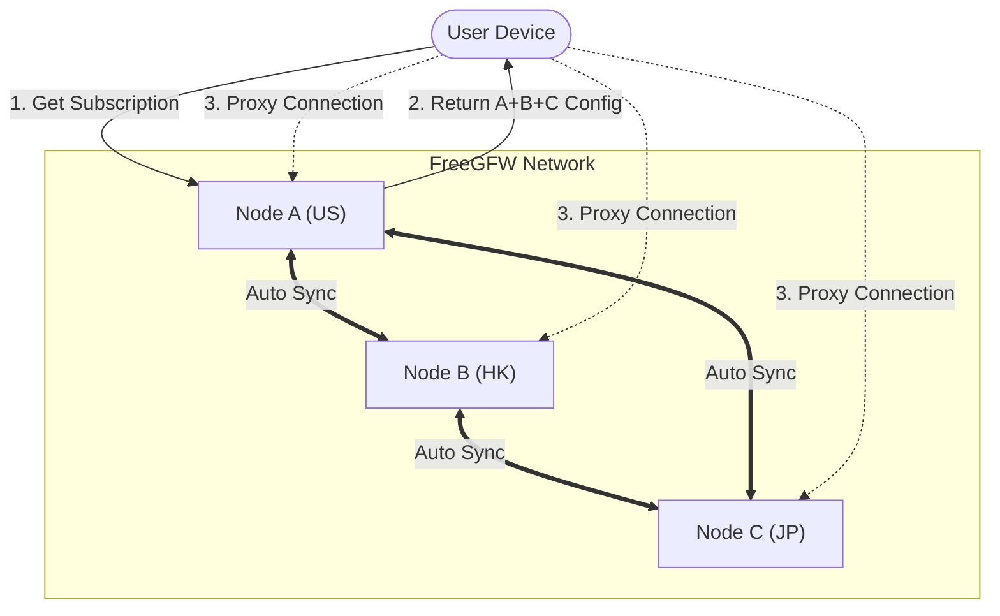

# FreeGFW

[English](README_EN.md) | [فارسی](README_FA.md) | [中文](README.md)


FreeGFW is a high-performance proxy service management system built on the [Sing-box](https://github.com/sagernet/sing-box) core. It provides a modern web interface for easily deploying, managing, and monitoring various proxy protocol services.

FreeGFW aims to provide a simple, powerful proxy management system, making it easy for users to deploy and manage their own proxy services. It simplifies circumvention, allowing ordinary people to easily use proxy services. To facilitate use by everyone, it fundamentally eliminates FreeGFW's fingerprint characteristics to avoid detection and scanning by search engines.

## 📸 Screenshots

<div>
  
  
</div>

## ✨ Key Features

- 🚀 **High Performance Core**: Built on Sing-box, supporting the latest proxy protocols and features.
- 🌐 **Multi-Protocol Support**: Native support for VLESS (Reality/Vision), VMess, Shadowsocks, Hysteria2, etc.
- 🖥️ **Modern Dashboard**: Built-in Web management interface built with React + TailwindCSS, intuitive and convenient.
- 👥 **User Management**: Supports multi-user system, assigning independent configurations for different users.
- 📊 **Traffic Monitoring**: Real-time monitoring of server upload/download speeds and user traffic usage.
- 🔒 **Auto HTTPS**: Integrated Let's Encrypt for automatic SSL certificate application and renewal.
- ⚡ **One-Click Deployment**: Supports Docker deployment or direct binary execution, ready out of the box.

## 🚀 Quick Start

### Docker Deployment

```bash
docker run -d --name freegfw --network=host \
  -v "data:/data" \
  ghcr.io/haradakashiwa/freegfw
```

## 📝 Configuration

- **Port Configuration**: Default port `8080`, can be modified via environment variable `PORT`.
- **Data Storage**: All data (database, certificates, config files) stored by default in `data/` directory.

## 🔗 Link Feature

FreeGFW innovatively introduces the "Link" feature, allowing you to interconnect multiple FreeGFW nodes to form a decentralized proxy network.

The original intention of designing this feature is that the characteristics of airports or service providers on the market are very obvious. We need to bypass this physical characteristic. Allowing users to build their own node proxy network is essentially decentralized, which can effectively reduce the risk of being blocked. At the same time, we hope to provide a simple and easy-to-use way to manage these nodes, so that users can easily add, delete, and manage their own nodes.

### Core Advantages

- **Subscription Aggregation**: Users only need to subscribe to any one node to get connection information for all nodes in the network.
- **Auto Sync**: Nodes automatically sync server configurations (IP, port, protocol, etc.) without manual updates.
- **Decentralization**: No central server, any two points can interconnect, suitable for building private proxy networks among family/friends.

### Topology Diagram



### Usage

1. **Generate Link**: In Node A's "Link Management", click "Add Link" to generate a one-time interconnection code.
2. **Establish Connection**: Enter the code on Node B.
3. **Auto Trust**: Both nodes will automatically exchange server info and start syncing status continuously.
4. **Unified Subscription**: At this point, your subscription link will automatically include all available nodes from Node A and Node B.

## 🤝 Contribution

Welcome to submit Issues and Pull Requests to help improve this project!

## 📄 License

GPLv3
