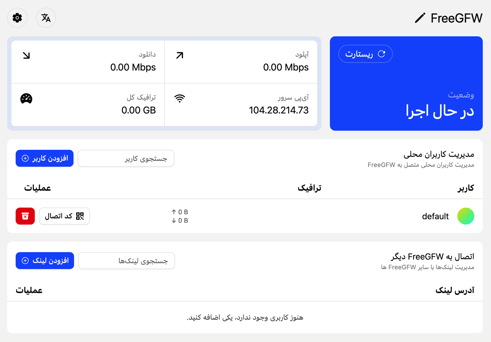
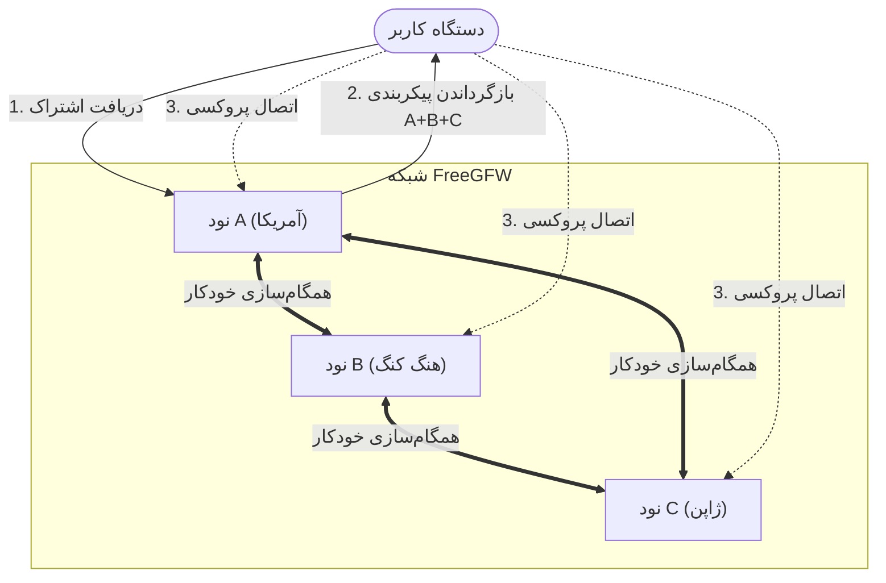

# FreeGFW

[English](README_EN.md) | [فارسی](README_FA.md) | [中文](README.md)


FreeGFW یک سیستم مدیریت سرویس پروکسی با کارایی بالا است که بر اساس هسته [Sing-box](https://github.com/sagernet/sing-box) ساخته شده است. این سیستم یک رابط وب مدرن برای استقرار، مدیریت و نظارت آسان بر سرویس‌های مختلف پروتکل پروکسی ارائه می‌دهد.

هدف FreeGFW ارائه یک سیستم مدیریت سرویس پروکسی ساده و قدرتمند است که به کاربران امکان می‌دهد به راحتی سرویس‌های پروکسی خود را استقرار و مدیریت کنند. این ابزار عبور از فیلترینگ را ساده می‌کند و به افراد عادی اجازه می‌دهد تا به راحتی از سرویس‌های پروکسی استفاده کنند. برای سهولت استفاده توسط همه، ویژگی‌های متمایز کننده FreeGFW را به طور اساسی حذف می‌کند تا از شناسایی و اسکن توسط موتورهای جستجو جلوگیری شود.

## 📸 پیش‌نمایش تصاویر

<div>
  
</div>

## ✨ ویژگی‌های اصلی

- 🚀 **هسته با کارایی بالا**: ساخته شده بر اساس Sing-box، با پشتیبانی از جدیدترین پروتکل‌ها و ویژگی‌های پروکسی.
- 🌐 **پشتیبانی از چند پروتکل**: پشتیبانی ذاتی از VLESS (Reality/Vision)، VMess، Shadowsocks، Hysteria2 و غیره.
- 🖥️ **داشبورد مدرن**: رابط مدیریت وب داخلی ساخته شده با React + TailwindCSS، بصری و راحت.
- 👥 **مدیریت کاربران**: پشتیبانی از سیستم چند کاربره، با امکان اختصاص تنظیمات مستقل برای کاربران مختلف.
- 📊 **نظارت بر ترافیک**: نظارت در لحظه بر سرعت آپلود/دانلود سرور و میزان مصرف ترافیک کاربران.
- 🔒 **HTTPS خودکار**: ادغام شده با Let's Encrypt برای درخواست و تمدید خودکار گواهینامه SSL.
- ⚡ **استقرار با یک کلیک**: پشتیبانی از استقرار با Docker یا اجرای مستقیم فایل باینری، آماده استفاده فوری.

## 🚀 شروع سریع

### استقرار با Docker

```bash
docker run -d --name freegfw --network=host \
  -v "data:/data" \
  ghcr.io/haradakashiwa/freegfw
```

## 📝 توضیحات پیکربندی

- **پیکربندی پورت**: پورت پیش‌فرض `8080` است که از طریق متغیر محیطی `PORT` قابل تغییر می‌باشد.
- **ذخیره‌سازی داده‌ها**: تمام داده‌ها (پایگاه داده، گواهینامه‌ها، فایل‌های پیکربندی) به صورت پیش‌فرض در دایرکتوری `data/` ذخیره می‌شوند.

## 🔗 ویژگی لینک (Link)

FreeGFW ویژگی نوآورانه «لینک» را معرفی کرده است که به شما امکان می‌دهد چندین نود FreeGFW را به هم متصل کنید تا یک شبکه پروکسی غیرمتمرکز تشکیل دهید.

هدف اصلی طراحی این ویژگی این است که ویژگی‌های سرویس‌دهندگان موجود در بازار بسیار آشکار هستند و ما باید این ویژگی فیزیکی را دور بزنیم. اجازه دادن به کاربران برای ساخت شبکه پروکسی نود خودشان که اساساً غیرمتمرکز است، می‌تواند به طور موثری خطر مسدود شدن را کاهش دهد. در عین حال، ما امیدواریم راهی ساده و آسان برای مدیریت این نودها فراهم کنیم تا کاربران بتوانند به راحتی نودهای خود را اضافه، حذف و مدیریت کنند.

### مزایای اصلی

- **تجمع اشتراک**: کاربران فقط کافی است مشترک هر یک از نودها شوند تا اطلاعات اتصال همه نودهای موجود در شبکه را دریافت کنند.
- **همگام‌سازی خودکار**: نودها به طور خودکار تنظیمات سرور (IP، پورت، پروتکل و غیره) را همگام‌سازی می‌کنند، بدون نیاز به به‌روزرسانی دستی.
- **غیرمتمرکز**: بدون سرور مرکزی، هر دو نقطه می‌توانند به هم متصل شوند، که برای ساخت شبکه‌های پروکسی خصوصی بین خانواده و دوستان مناسب است.

### نمودار توپولوژی



### روش استفاده

1. **تولید لینک**: در قسمت «مدیریت لینک» در نود A، روی «افزودن لینک» کلیک کنید تا یک کد اتصال یک‌بار مصرف ایجاد شود.
2. **برقراری اتصال**: کد را در نود B وارد کنید.
3. **اعتماد خودکار**: هر دو نود به طور خودکار اطلاعات سرور را مبادله کرده و شروع به همگام‌سازی مداوم وضعیت می‌کنند.
4. **اشتراک یکپارچه**: در این مرحله، لینک اشتراک شما به طور خودکار شامل همه نودهای موجود از نود A و نود B خواهد بود.

## 🤝 مشارکت

از ارسال Issue و Pull Request برای کمک به بهبود این پروژه استقبال می‌شود!

## 📄 مجوز

GPLv3
